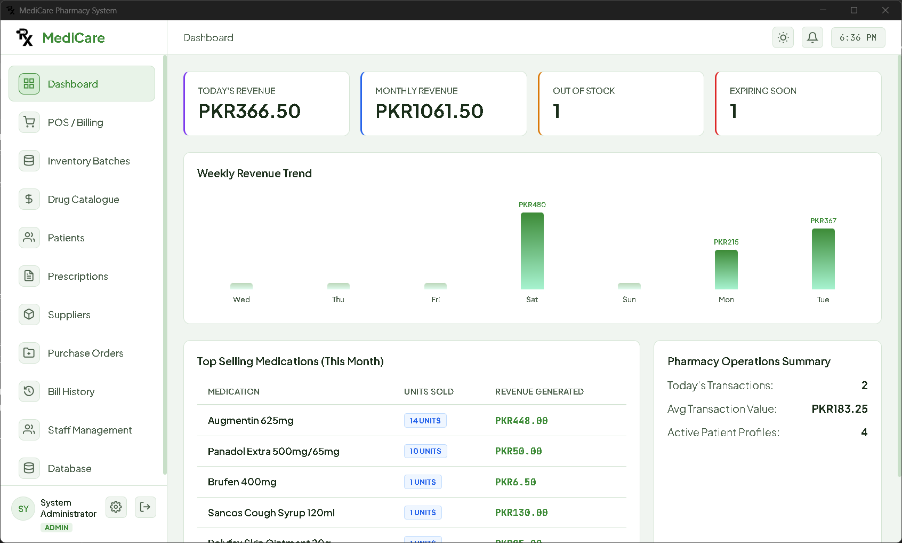
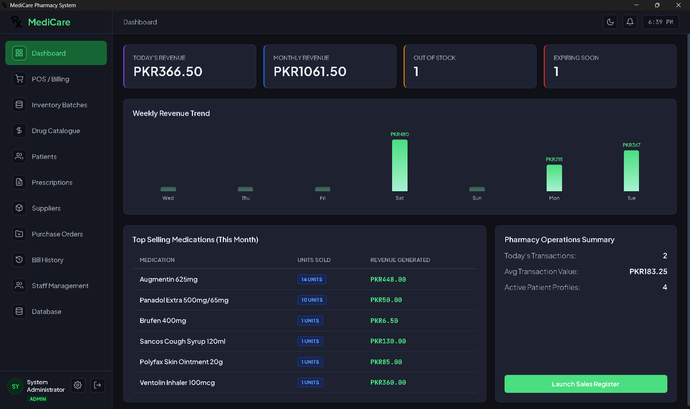
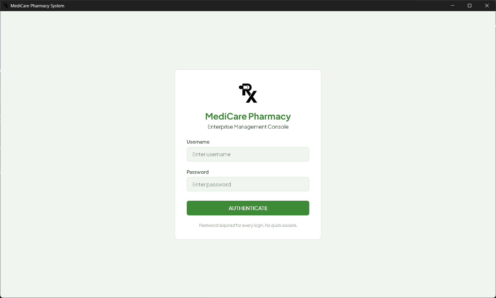
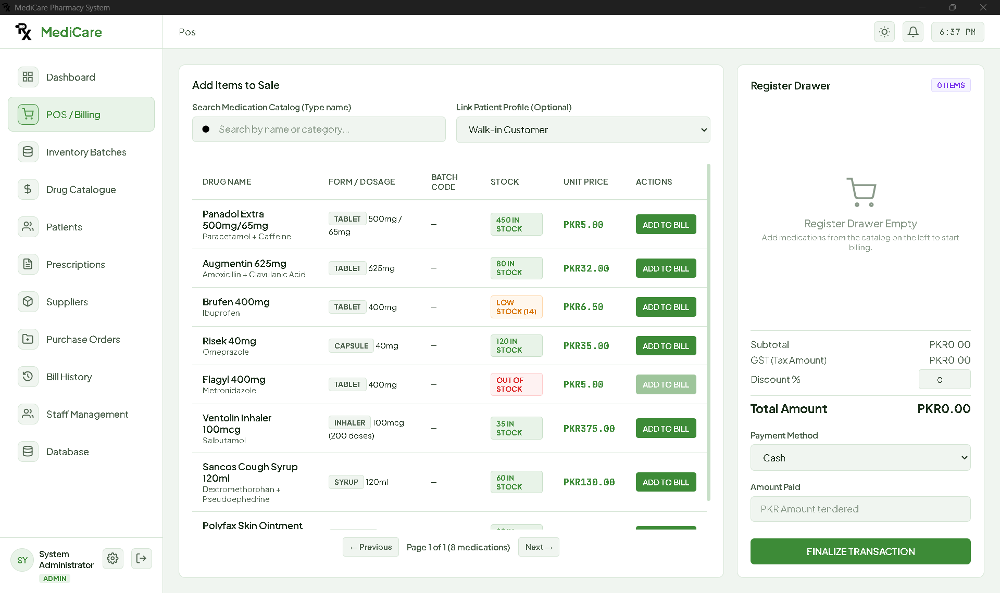
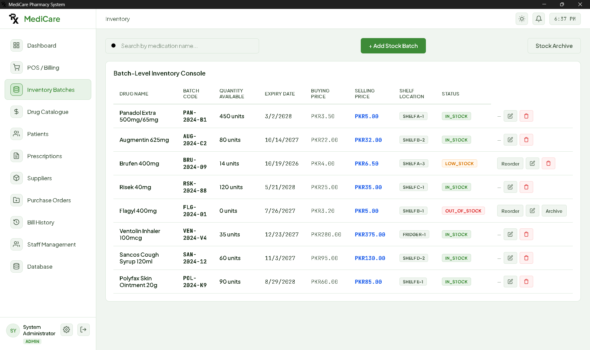
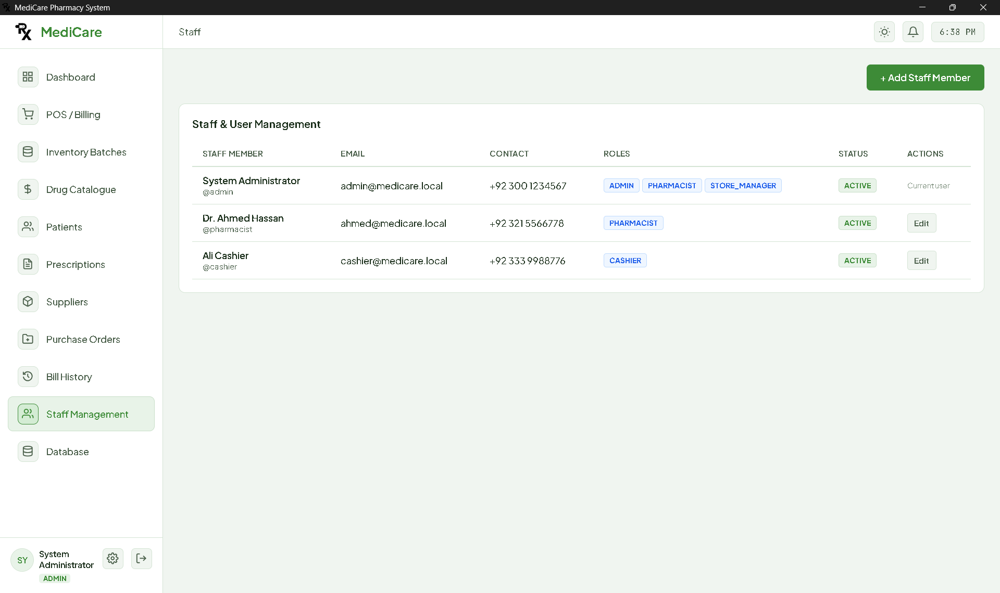
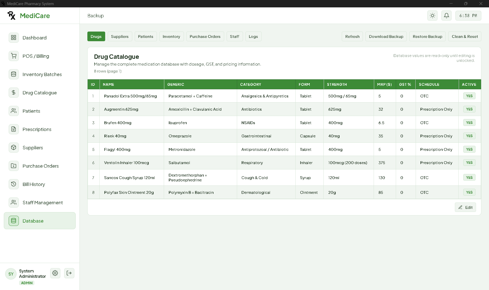
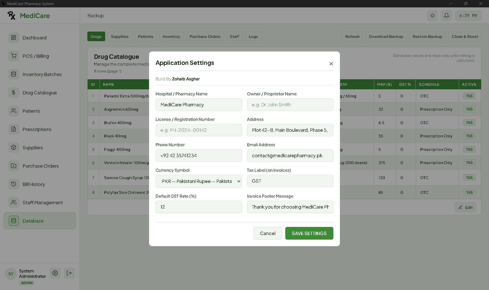

# 💊 MediCare — Advanced Pharmacy Management System

[](https://nodejs.org/)
[](https://www.electronjs.org/)
[](https://expressjs.com/)
[](https://www.sqlite.org/)
[]()
[]()

**MediCare** is a modern, enterprise-grade desktop application engineered for community, retail, and clinical pharmacies. Built with **Electron**, **Node.js Express**, and modern responsive web technologies, MediCare delivers high-speed point-of-sale transactions, intelligent inventory tracking, digital prescription processing, supplier relations, and local cryptographic security.

---

<p align="center">
  
  
  <br>
  <em>Real-Time Operations Dashboard — Seamless Light &amp; Dark Theme Support</em>
</p>

---

## 📸 Application Showcase

### 1. Modern Authentication Gateway
Protected with a 5-failed-attempts threshold, automatic 60-second account lockout that persists across restarts, and a live countdown timer.
<p align="center">
  
</p>

### 2. Point of Sale (POS) & Fast Billing
Instant drug search, automatic discount and tax calculations, change return helper, and direct thermal receipt printing / PDF export.
<p align="center">
  
</p>

### 3. Medication Inventory & Batch Tracking
Multi-batch management, First-Expiry-First-Out (FEFO) automated deduction, reorder alerts, and stock write-offs.
<p align="center">
  
</p>

### 4. Staff & Role-Based Access Control (RBAC)
Granular permissions for Administrators, Store Managers, Pharmacists, and Cashiers with bcrypt password security.
<p align="center">
  
</p>

### 5. Database Explorer, Backup & Instant Restore
Interactive backup security dialog (Standard `.mbak` vs Encrypted `.enc.mbak` with military-grade AES-256-GCM PBKDF2), direct restore, and clean reset.
<p align="center">
  
</p>

### 6. Dynamic Pharmacy Branding & Operations
Configure pharmacy name, contact details, tax numbers, and custom invoice footer messages dynamically.
<p align="center">
  
</p>

---

## 🌟 Key Capabilities & Features

### 🛒 High-Speed Point of Sale (POS) & Smart Billing
* **Instant Drug Search**: Live searching across trade names, generic formulas, dosage forms, and therapeutic categories.
* **Smart Cart Engine**: Automatic calculation of subtotals, item-level discounts, configurable GST/tax rates, and real-time cash return calculation.
* **Receipt & Invoice Printing**: Native Chromium print integration with full hardware support for standard 80mm/58mm thermal receipt printers, laser printers, and **Microsoft Print to PDF**.
* **Billing History & Receipts**: Instant invoice reprint and customer receipt lookup.

### 📦 Medication & Inventory Management
* **Batch & Expiry Control**: Monitor multiple batches per medication with manufacturing dates, expiry dates, purchase costs, and retail prices.
* **FEFO Stock Deductions**: Automated First-Expiry-First-Out dispensing logic ensures older stock is sold before newer inventory.
* **Stock Health Tracking**: Instant visibility into out-of-stock items, items below minimum reorder thresholds, and expiring batches.
* **Inventory Write-offs**: Safe removal of damaged or expired batches with full audit trail logging.

### 📋 Prescription Management & Dispensing
* **Digital Prescription Workflow**: Track prescribing doctors, patient details, dosage directions, and prescription validity.
* **One-Click Dispense**: Auto-verifies stock availability and deducts inventory in compliance with pharmacy standards.
* **Cancellation Support**: Reverse pending or invalid prescriptions with proper status tracking.

### 👥 Patient Registry
* **Comprehensive Profiles**: Manage patient demographics, contact numbers, residential addresses, and known drug allergies.
* **Full Profile Removal**: Full CRUD management including safe deletion of inactive or duplicate patient records.

### 🚚 Supplier Directory & Purchase Orders
* **Vendor Directory**: Track supplier contact details, company information, and financial balances.
* **Purchase Order Lifecycle**: Create purchase orders, track approval status, and print professional PO documents.
* **Goods Receiving & Batch Ingestion**: One-click PO receipt automatically generates and updates stock inventory batches.
* **Supplier Payments**: Record and monitor supplier payments against purchase orders.

### 🛡️ Security, Hardening & Brute-Force Protection
* **Persistent Lockout Defense**: Enforces a strict 5-failed-attempts threshold triggering an automatic **60-second account lockout**. Lockout status persists on disk across application closes and system reboots.
* **Session-Only Tokens**: Automatically logs out on application window close to protect patient and business data.
* **Role-Based Access Control (RBAC)**: Distinct permissions for `ROLE_ADMIN`, `ROLE_STORE_MANAGER`, `ROLE_PHARMACIST`, and `ROLE_CASHIER`.
* **Password Hashing**: Secure bcrypt hashing for all staff credentials.

### 🔐 Interactive Backup Security (.mbak / .enc.mbak)
* **Interactive Export Security**: When downloading a backup, choose between:
  * **Standard Backup (`.mbak`)**: Unencrypted direct export, fast and restorable with a single click.
  * **Encrypted Backup (`.enc.mbak`)**: Secured with military-grade **AES-256-GCM** encryption (derived via PBKDF2 with 210,000 iterations).
* **Direct Unencrypted Restore**: Restoring standard backups does not prompt for passwords.
* **Password Decryption**: Automatically prompts for the decryption password only when an encrypted backup is detected.
* **Clean & Reset Database**: Built-in option to wipe sample data and return to a clean operational state.

### 🔔 Real-Time Startup Operational Alerts
* **Startup Health Scanner**: On every application startup, login, and restart, the system scans all inventory batches.
* **Visual Screen Toasts**: Immediately alerts pharmacy staff to critical operational events:
  * Out-of-stock items (e.g. *"Flagyl 400mg is completely out of stock!"*)
  * Low-stock warnings when inventory drops below reorder level.
  * Expired medication warnings and expiring-soon reminders.
* **Notification Center**: Bell icon dropdown with badge counters and quick navigation to inventory or suppliers.

---

## 🛠️ Technology Stack

* **Frontend**: HTML5, CSS3 (Modern Glassmorphism, Dark/Light Themes), Vanilla JavaScript (ES6+).
* **Desktop Shell**: [Electron](https://www.electronjs.org/) v35 with isolated context and secure IPC bridge.
* **Backend API**: [Express.js](https://expressjs.com/) v4.21 running on Node.js.
* **Cryptography**: WebCrypto API & Node.js native `crypto` module (AES-256-GCM, PBKDF2, bcryptjs).
* **Packaging**: [electron-builder](https://www.electron.build/) for portable executables and NSIS installers.

---

## 🚀 Getting Started

### Prerequisites
* [Node.js](https://nodejs.org/) v18.0.0 or higher
* npm v9.0.0 or higher

### Installation

1. **Clone the repository:**
   ```bash
   git clone https://github.com/Zohaib154/Pharmacy-Management-System.git
   cd Pharmacy-Management-System
   ```

2. **Install dependencies:**
   ```bash
   npm install
   ```

3. **Start the application in development mode:**
   ```bash
   npm start
   ```

---

## 📦 Building Windows Executables

You can compile standalone production executables using the built-in scripts:

### 1. Standalone Portable Version (`MediCare-Portable.exe`)
Runs directly without installation. Ideal for USB drives or quick deployment:
```bash
npm run build:portable
```
*Output artifact:* `dist/MediCare-Portable.exe` (~77.9 MB)

### 2. Windows Installer Version (`MediCare-Setup.exe`)
Standard Windows setup wizard with Desktop icon, Start Menu shortcut, and uninstaller:
```bash
npm run build:installer
```
*Output artifact:* `dist/MediCare-Setup.exe` (~78.1 MB)

### 3. Build Both Distributions
```bash
npm run build
```

---

## 🔐 Default Credentials

| Username | Password   | Role         |
|:---------|:-----------|:-------------|
| `admin`  | `admin123` | ROLE_ADMIN   |

---

## 📁 Repository Structure

```
├── backend/
│   ├── db.js                 # High-performance JSON database engine with atomic disk persistence
│   └── security.js           # Brute-force persistent lockout & AES-256 backup encryption
├── build/
│   ├── icon.ico              # Multi-resolution Windows application icon
│   └── icon.png              # PNG branding asset
├── static/
│   ├── assets/               # Branding logos and graphics
│   ├── css/                  # Responsive stylesheets, dark/light themes, print layouts
│   ├── js/                   # Modular controllers (POS, inventory, auth, backup, patients, etc.)
│   └── index.html            # Main single-page application interface
├── submission-images/        # High-resolution screenshots of the application
│   ├── DASHBOARD.png         # Operational dashboard (Light Mode)
│   ├── DASHBOARD_DARK.png    # Operational dashboard (Dark Mode)
│   ├── DATABASE.png          # Database browser & backup/restore
│   ├── INVENTORY.png         # Medication inventory & batch tracking
│   ├── LOGIN.png             # Login authentication gateway
│   ├── POS.png               # Point of Sale & billing terminal
│   ├── SETTING.png           # Pharmacy branding & settings
│   └── STAFF.png             # Staff management & RBAC
├── demo_database_backup.mbak # Pre-seeded demo database for testing
├── main.js                   # Electron main process & desktop window lifecycle
├── preload.js                # Secure IPC bridge
├── server.js                 # Express backend server with full REST APIs
├── package.json              # Application dependencies and build scripts
├── RELEASE_NOTES.md          # Official v1.0.0 release notes
└── README.md                 # Project documentation
```

---

## 📄 License & Credits

* **Author**: [Zohaib Asghar](https://github.com/Zohaib154)
* **License**: MIT License
